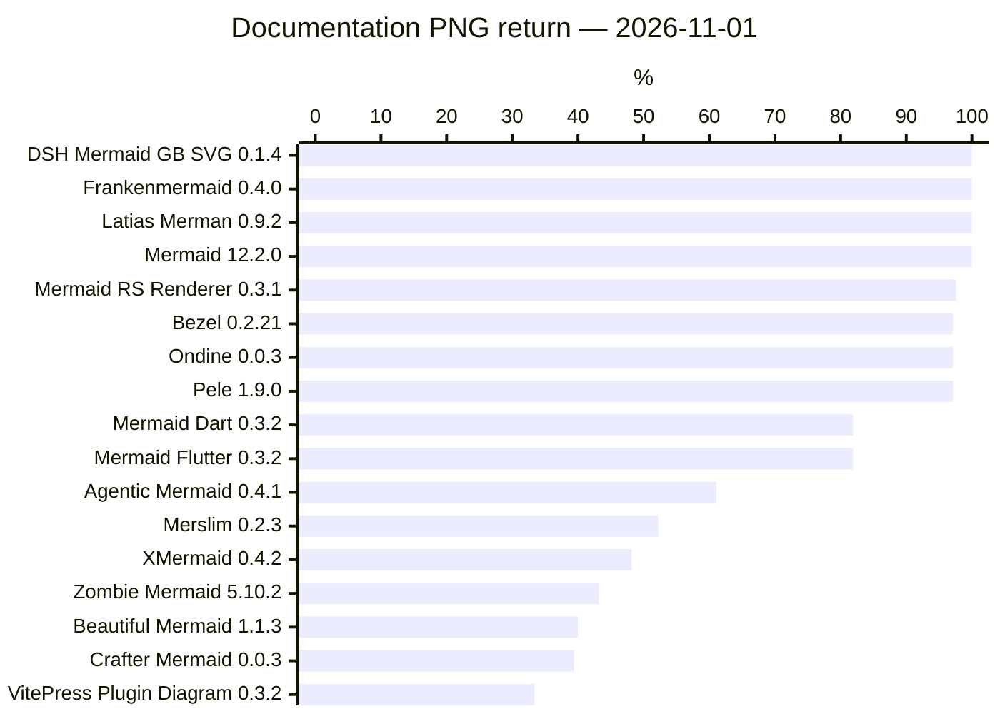
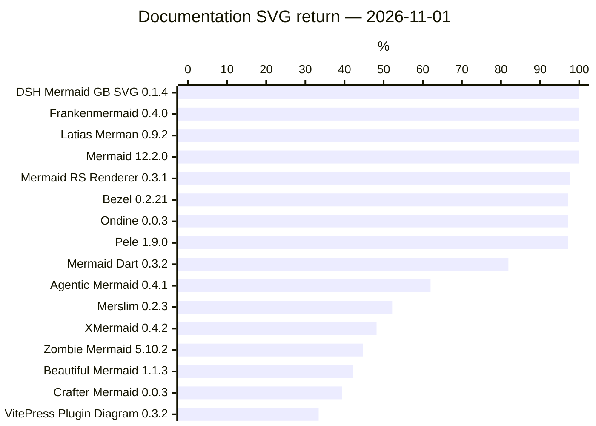

# DaveBench — Documentation Rendering · part 1

[Ecosystem overview](../../RESULTS.md) · [All parts](docs.md)

**run-0ed76179c115bf2cd81ed5c5** · 2026-11-01 · unit: documentation drawings · [evidence](https://raw.githubusercontent.com/adewale/trident/2c464366c5f05c01b29e41993a64e1eddb77be58/evidence/2/report.json)

Corpus: the same pinned Mermaid documentation inventory. First-round actual PNG witnesses checked against source expectations. PNG content reviews bind actual image, source and expected-fact hashes; SVG and nonblank checks supply no raster correctness credit. Rank counts verified correct drawings out of 546; 1 configuration example(s) and 1 independently invalid-source control(s) are separate. Unassessed sources/observers, unrun work and typed failures remain separate. Bounds span unresolved cases only; observer coverage counts actual drawing or format verdicts. Overlapping bounds establish no accuracy winner. Complete accuracy requires zero unresolved cases; speed requires its own qualified timing evidence.

Ranked by **Correct**, highest first. Equal values share a rank; unavailable values are unranked.

Ranks order verified correct counts once an outcome is resolved; observed zero remains ranked and fully unresolved rows are unranked. Observer coverage counts drawing and format verdicts. Correctness bounds include unresolved cases; overlapping bounds establish no accuracy winner. Unsupported inputs and proven renderer failures remain explicit non-successes on this corpus.

Comparisons claim superiority only when correctness bounds are disjoint; otherwise they describe verified-count differences. This is a comparison of the named metric, not overall project quality.

| Project | Verified-count rank | Version | Correct | Incorrect drawing | Invalid format | Unsupported | Renderer failure | Unassessed | Unrun | Harness failure | Planned drawings | Observer coverage (%) | Correctness lower (%) | Correctness upper (%) | Measured | vs Mermaid | Ranking note |
| --- | --- | --- | --- | --- | --- | --- | --- | --- | --- | --- | --- | --- | --- | --- | --- | --- | --- |
| Mermaid | 1 | 12.2.0 | 431 | 43 | 0 | 0 | 0 | 72 | 0 | 0 | 546 | 86.8 | 78.9 | 92.1 | 2026-11-01T16:11:48.486Z | Baseline |  |
| Mermaid Flutter | 2 | 0.3.2 | 297 | 138 | 0 | 0 | 0 | 111 | 0 | 0 | 546 | 79.7 | 54.4 | 74.7 | 2026-11-01T17:36:05.583027Z | Lower on this corpus (-134 verified); disjoint bounds |  |
| Latias Merman | 3 | 0.9.2 | 94 | 10 | 0 | 0 | 0 | 442 | 0 | 0 | 546 | 19.0 | 17.2 | 98.2 | 2026-11-01T13:17:40.908Z | Fewer verified (-337); bounds overlap |  |
| Crafter Mermaid | 4 | 0.0.3 | 0 | 15 | 0 | 0 | 0 | 531 | 0 | 0 | 546 | 2.7 | 0.0 | 97.3 | 2026-11-01T12:43:07.981Z | Fewer verified (-431); bounds overlap |  |
| Frankenmermaid | 4 | 0.4.0 | 0 | 2 | 0 | 0 | 0 | 544 | 0 | 0 | 546 | 0.4 | 0.0 | 99.6 | 2026-11-01T12:52:22.568Z | Fewer verified (-431); bounds overlap |  |
| Mermaid RS Renderer | 4 | 0.3.1 | 0 | 5 | 0 | 0 | 0 | 541 | 0 | 0 | 546 | 0.9 | 0.0 | 99.1 | 2026-11-01T12:34:21.308Z | Fewer verified (-431); bounds overlap |  |
| Merslim | 4 | 0.2.3 | 0 | 79 | 0 | 0 | 0 | 467 | 0 | 0 | 546 | 14.5 | 0.0 | 85.5 | 2026-11-01T12:56:59.533Z | Fewer verified (-431); bounds overlap |  |
| VitePress Plugin Diagram | 4 | 0.3.2 | 0 | 1 | 0 | 0 | 0 | 545 | 0 | 0 | 546 | 0.2 | 0.0 | 99.8 | 2026-11-01T13:07:57.827Z | Fewer verified (-431); bounds overlap |  |
| Agentic Mermaid | — | 0.4.1 | 0 | 0 | 0 | 0 | 0 | 546 | 0 | 0 | 546 | 0.0 | 0.0 | 100.0 | 2026-11-01T12:37:57.996Z | Fewer verified (-431); bounds overlap | No verified drawing-content observations |
| Beautiful Mermaid | — | 1.1.3 | 0 | 0 | 0 | 0 | 0 | 546 | 0 | 0 | 546 | 0.0 | 0.0 | 100.0 | 2026-11-01T13:26:04.258Z | Fewer verified (-431); bounds overlap | No verified drawing-content observations |
| Bezel | — | 0.2.21 | 0 | 0 | 0 | 0 | 0 | 546 | 0 | 0 | 546 | 0.0 | 0.0 | 100.0 | 2026-11-01T12:41:35.690Z | Fewer verified (-431); bounds overlap | No verified drawing-content observations |
| DSH Mermaid GB SVG | — | 0.1.4 | 0 | 0 | 0 | 0 | 0 | 546 | 0 | 0 | 546 | 0.0 | 0.0 | 100.0 | 2026-11-01T14:13:18.612Z | Fewer verified (-431); bounds overlap | No verified drawing-content observations |
| Mermaid Dart | — | 0.3.2 | 0 | 0 | 0 | 0 | 0 | 546 | 0 | 0 | 546 | 0.0 | 0.0 | 100.0 | 2026-11-01T14:00:31.418Z | Fewer verified (-431); bounds overlap | No verified drawing-content observations |
| Ondine | — | 0.0.3 | 0 | 0 | 0 | 0 | 0 | 546 | 0 | 0 | 546 | 0.0 | 0.0 | 100.0 | 2026-11-01T14:27:38.234Z | Fewer verified (-431); bounds overlap | No verified drawing-content observations |
| Pele | — | 1.9.0 | 0 | 0 | 0 | 0 | 0 | 546 | 0 | 0 | 546 | 0.0 | 0.0 | 100.0 | 2026-11-01T13:48:39.518Z | Fewer verified (-431); bounds overlap | No verified drawing-content observations |
| XMermaid | — | 0.4.2 | 0 | 0 | 0 | 0 | 0 | 546 | 0 | 0 | 546 | 0.0 | 0.0 | 100.0 | 2026-11-01T13:02:12.471Z | Fewer verified (-431); bounds overlap | No verified drawing-content observations |
| Zombie Mermaid | — | 5.10.2 | 0 | 0 | 0 | 0 | 0 | 546 | 0 | 0 | 546 | 0.0 | 0.0 | 100.0 | 2026-11-01T12:46:01.801Z | Fewer verified (-431); bounds overlap | No verified drawing-content observations |

**run-c69b61e4228a0b2c9388923a** · 2026-11-01 · unit: documentation drawings · [evidence](https://raw.githubusercontent.com/adewale/trident/2c464366c5f05c01b29e41993a64e1eddb77be58/evidence/1/report.json)

Corpus: the same pinned Mermaid documentation inventory. First-round actual SVG witnesses checked against source expectations. Shared SVG paint/meaning observer. Rank counts verified correct drawings out of 546; 1 configuration example(s) and 1 independently invalid-source control(s) are separate. Unassessed sources/observers, unrun work and typed failures remain separate. Bounds span unresolved cases only; observer coverage counts actual drawing or format verdicts. Overlapping bounds establish no accuracy winner. Complete accuracy requires zero unresolved cases; speed requires its own qualified timing evidence.

Ranked by **Correct**, highest first. Equal values share a rank; unavailable values are unranked.

Ranks order verified correct counts once an outcome is resolved; observed zero remains ranked and fully unresolved rows are unranked. Observer coverage counts drawing and format verdicts. Correctness bounds include unresolved cases; overlapping bounds establish no accuracy winner. Unsupported inputs and proven renderer failures remain explicit non-successes on this corpus.

Comparisons claim superiority only when correctness bounds are disjoint; otherwise they describe verified-count differences. This is a comparison of the named metric, not overall project quality.

| Project | Verified-count rank | Version | Correct | Incorrect drawing | Invalid format | Unsupported | Renderer failure | Unassessed | Unrun | Harness failure | Planned drawings | Observer coverage (%) | Correctness lower (%) | Correctness upper (%) | Measured | vs Mermaid |
| --- | --- | --- | --- | --- | --- | --- | --- | --- | --- | --- | --- | --- | --- | --- | --- | --- |
| Mermaid | 1 | 12.2.0 | 331 | 54 | 0 | 0 | 0 | 161 | 0 | 0 | 546 | 70.5 | 60.6 | 90.1 | 2026-11-01T12:24:33.018Z | Baseline |
| Latias Merman | 2 | 0.9.2 | 240 | 55 | 0 | 0 | 0 | 251 | 0 | 0 | 546 | 54.0 | 44.0 | 89.9 | 2026-11-01T11:58:59.589Z | Fewer verified (-91); bounds overlap |
| Bezel | 3 | 0.2.21 | 238 | 49 | 0 | 0 | 0 | 259 | 0 | 0 | 546 | 52.6 | 43.6 | 91.0 | 2026-11-01T12:32:25.974Z | Fewer verified (-93); bounds overlap |
| Pele | 3 | 1.9.0 | 238 | 49 | 0 | 0 | 0 | 259 | 0 | 0 | 546 | 52.6 | 43.6 | 91.0 | 2026-11-01T12:10:16.658Z | Fewer verified (-93); bounds overlap |
| Ondine | 5 | 0.0.3 | 236 | 48 | 0 | 0 | 0 | 262 | 0 | 0 | 546 | 52.0 | 43.2 | 91.2 | 2026-11-01T11:30:42.973Z | Fewer verified (-95); bounds overlap |
| Mermaid Dart | 6 | 0.3.2 | 146 | 116 | 0 | 0 | 0 | 284 | 0 | 0 | 546 | 48.0 | 26.7 | 78.8 | 2026-11-01T11:33:32.002Z | Fewer verified (-185); bounds overlap |
| Frankenmermaid | 7 | 0.4.0 | 110 | 189 | 0 | 0 | 0 | 244 | 0 | 3 | 546 | 54.8 | 20.1 | 65.4 | 2026-11-01T11:27:18.840Z | Fewer verified (-221); bounds overlap |
| Agentic Mermaid | 8 | 0.4.1 | 91 | 83 | 0 | 0 | 0 | 372 | 0 | 0 | 546 | 31.9 | 16.7 | 84.8 | 2026-11-01T11:35:32.452Z | Fewer verified (-240); bounds overlap |
| Zombie Mermaid | 9 | 5.10.2 | 72 | 61 | 0 | 0 | 0 | 413 | 0 | 0 | 546 | 24.4 | 13.2 | 88.8 | 2026-11-01T11:38:06.717Z | Fewer verified (-259); bounds overlap |
| Mermaid RS Renderer | 10 | 0.3.1 | 55 | 270 | 0 | 0 | 0 | 221 | 0 | 0 | 546 | 59.5 | 10.1 | 50.5 | 2026-11-01T11:40:49.082Z | Lower on this corpus (-276 verified); disjoint bounds |
| XMermaid | 11 | 0.4.2 | 34 | 86 | 0 | 0 | 0 | 426 | 0 | 0 | 546 | 22.0 | 6.2 | 84.2 | 2026-11-01T11:48:42.561Z | Fewer verified (-297); bounds overlap |
| Beautiful Mermaid | 12 | 1.1.3 | 29 | 155 | 0 | 0 | 0 | 362 | 0 | 0 | 546 | 33.7 | 5.3 | 71.6 | 2026-11-01T12:03:14.712Z | Fewer verified (-302); bounds overlap |
| Crafter Mermaid | 13 | 0.0.3 | 26 | 157 | 0 | 0 | 0 | 363 | 0 | 0 | 546 | 33.5 | 4.8 | 71.2 | 2026-11-01T11:42:47.418Z | Fewer verified (-305); bounds overlap |
| Merslim | 14 | 0.2.3 | 16 | 200 | 0 | 0 | 0 | 330 | 0 | 0 | 546 | 39.6 | 2.9 | 63.4 | 2026-11-01T11:45:50.321Z | Fewer verified (-315); bounds overlap |
| DSH Mermaid GB SVG | 15 | 0.1.4 | 15 | 457 | 0 | 0 | 0 | 72 | 0 | 2 | 546 | 86.4 | 2.7 | 16.3 | 2026-11-01T12:15:06.214Z | Lower on this corpus (-316 verified); disjoint bounds |
| VitePress Plugin Diagram | 16 | 0.3.2 | 0 | 147 | 0 | 0 | 0 | 399 | 0 | 0 | 546 | 26.9 | 0.0 | 73.1 | 2026-11-01T11:51:34.319Z | Fewer verified (-331); bounds overlap |

**run-4cba210a4cf14cd50f478f9e** · 2026-11-01 · unit: documentation occurrences · [evidence](https://raw.githubusercontent.com/adewale/trident/2c464366c5f05c01b29e41993a64e1eddb77be58/evidence/2/report.json)

Corpus: Mermaid syntax documentation at 1fb7869866dd619168d840291c9c54b4f129758b; 548 occurrences, retaining duplicates. PNG output lane. Returned means the occurrence returned PNG in all 1 declared rounds. Failures and unexecuted work retain the full inventory. Output return does not certify drawing content.

Ranked by **Returned in all rounds / Planned**, highest first. Equal values share a rank; unavailable values are unranked.

“Higher” and “Lower” compare **Returned in all rounds** on this population. Unknown evidence remains unresolved. This is a comparison of the named metric, not overall project quality.

| Project | Rank | Version | Returned in all rounds | Failed | Unsupported | Blocked | Unexecuted | Partially observed | Planned | Measured | vs Mermaid | % |
| --- | --- | --- | --- | --- | --- | --- | --- | --- | --- | --- | --- | --- |
| DSH Mermaid GB SVG | 1 | 0.1.4 | 548 | 0 | 0 | 0 | 0 | 0 | 548 | 2026-11-01T14:13:18.612Z | Tie | 100.0% |
| Frankenmermaid | 1 | 0.4.0 | 548 | 0 | 0 | 0 | 0 | 0 | 548 | 2026-11-01T12:52:22.568Z | Tie | 100.0% |
| Latias Merman | 1 | 0.9.2 | 548 | 0 | 0 | 0 | 0 | 0 | 548 | 2026-11-01T13:17:40.908Z | Tie | 100.0% |
| Mermaid | 1 | 12.2.0 | 548 | 0 | 0 | 0 | 0 | 0 | 548 | 2026-11-01T16:11:48.486Z | Baseline | 100.0% |
| Mermaid RS Renderer | 5 | 0.3.1 | 535 | 13 | 0 | 0 | 0 | 0 | 548 | 2026-11-01T12:34:21.308Z | Lower (-13) | 97.6% |
| Bezel | 6 | 0.2.21 | 532 | 16 | 0 | 0 | 0 | 0 | 548 | 2026-11-01T12:41:35.690Z | Lower (-16) | 97.1% |
| Ondine | 6 | 0.0.3 | 532 | 16 | 0 | 0 | 0 | 0 | 548 | 2026-11-01T14:27:38.234Z | Lower (-16) | 97.1% |
| Pele | 6 | 1.9.0 | 532 | 16 | 0 | 0 | 0 | 0 | 548 | 2026-11-01T13:48:39.518Z | Lower (-16) | 97.1% |
| Mermaid Dart | 9 | 0.3.2 | 449 | 99 | 0 | 0 | 0 | 0 | 548 | 2026-11-01T14:00:31.418Z | Lower (-99) | 81.9% |
| Mermaid Flutter | 9 | 0.3.2 | 449 | 99 | 0 | 0 | 0 | 0 | 548 | 2026-11-01T17:36:05.583027Z | Lower (-99) | 81.9% |
| Agentic Mermaid | 11 | 0.4.1 | 335 | 213 | 0 | 0 | 0 | 0 | 548 | 2026-11-01T12:37:57.996Z | Lower (-213) | 61.1% |
| Merslim | 12 | 0.2.3 | 286 | 262 | 0 | 0 | 0 | 0 | 548 | 2026-11-01T12:56:59.533Z | Lower (-262) | 52.2% |
| XMermaid | 13 | 0.4.2 | 264 | 284 | 0 | 0 | 0 | 0 | 548 | 2026-11-01T13:02:12.471Z | Lower (-284) | 48.2% |
| Zombie Mermaid | 14 | 5.10.2 | 237 | 311 | 0 | 0 | 0 | 0 | 548 | 2026-11-01T12:46:01.801Z | Lower (-311) | 43.2% |
| Beautiful Mermaid | 15 | 1.1.3 | 219 | 329 | 0 | 0 | 0 | 0 | 548 | 2026-11-01T13:26:04.258Z | Lower (-329) | 40.0% |
| Crafter Mermaid | 16 | 0.0.3 | 216 | 332 | 0 | 0 | 0 | 0 | 548 | 2026-11-01T12:43:07.981Z | Lower (-332) | 39.4% |
| VitePress Plugin Diagram | 17 | 0.3.2 | 183 | 365 | 0 | 0 | 0 | 0 | 548 | 2026-11-01T13:07:57.827Z | Lower (-365) | 33.4% |

```mermaid
xychart-beta horizontal
    title "Documentation PNG return — 2026-11-01"
    x-axis ["DSH Mermaid GB SVG 0.1.4", "Frankenmermaid 0.4.0", "Latias Merman 0.9.2", "Mermaid 12.2.0", "Mermaid RS Renderer 0.3.1", "Bezel 0.2.21", "Ondine 0.0.3", "Pele 1.9.0", "Mermaid Dart 0.3.2", "Mermaid Flutter 0.3.2", "Agentic Mermaid 0.4.1", "Merslim 0.2.3", "XMermaid 0.4.2", "Zombie Mermaid 5.10.2", "Beautiful Mermaid 1.1.3", "Crafter Mermaid 0.0.3", "VitePress Plugin Diagram 0.3.2"]
    y-axis "%" 0 --> 100
    bar [100, 100, 100, 100, 97.6, 97.1, 97.1, 97.1, 81.9, 81.9, 61.1, 52.2, 48.2, 43.2, 40, 39.4, 33.4]
```

**run-7a5fab897e6aeacafe4a0c73** · 2026-11-01 · unit: invalid-source controls · [evidence](https://raw.githubusercontent.com/adewale/trident/2c464366c5f05c01b29e41993a64e1eddb77be58/evidence/2/report.json)

Corpus: 1 invalid-source documentation example(s), retained verbatim in the 548-occurrence inventory. A source-bound typed native rejection passes; an actual public return fails. Generic exceptions and missing evidence remain unknown.

Ranked by **Correct rejection**, highest first. Equal values share a rank; unavailable values are unranked.

“Higher” and “Lower” compare **Correct rejection** on this population. Unknown evidence remains unresolved. This is a comparison of the named metric, not overall project quality.

| Project | Rank | Version | Correct rejection | Accepted invalid source | Unknown | Planned controls | Measured | vs Mermaid | Ranking note |
| --- | --- | --- | --- | --- | --- | --- | --- | --- | --- |
| Bezel | 1 | 0.2.21 | 0 | 1 | 0 | 1 | 2026-11-01T12:40:32.063Z | Tie |  |
| DSH Mermaid GB SVG | 1 | 0.1.4 | 0 | 1 | 0 | 1 | 2026-11-01T14:07:21.908Z | Tie |  |
| Frankenmermaid | 1 | 0.4.0 | 0 | 1 | 0 | 1 | 2026-11-01T12:49:13.413Z | Tie |  |
| Latias Merman | 1 | 0.9.2 | 0 | 1 | 0 | 1 | 2026-11-01T13:12:53.966Z | Tie |  |
| Mermaid | 1 | 12.2.0 | 0 | 1 | 0 | 1 | 2026-11-01T16:08:57.413Z | Baseline |  |
| Mermaid Dart | 1 | 0.3.2 | 0 | 1 | 0 | 1 | 2026-11-01T13:54:49.539Z | Tie |  |
| Mermaid Flutter | 1 | 0.3.2 | 0 | 1 | 0 | 1 | 2026-11-01T17:38:08.731Z | Tie |  |
| Mermaid RS Renderer | 1 | 0.3.1 | 0 | 1 | 0 | 1 | 2026-11-01T12:33:15.619Z | Tie |  |
| Ondine | 1 | 0.0.3 | 0 | 1 | 0 | 1 | 2026-11-01T14:20:38.926Z | Tie |  |
| Pele | 1 | 1.9.0 | 0 | 1 | 0 | 1 | 2026-11-01T13:43:50.760Z | Tie |  |
| Agentic Mermaid | — | 0.4.1 | 0 | 0 | 1 | 1 | 2026-11-01T12:37:24.802Z | Unresolved | No qualified source-control observation |
| Beautiful Mermaid | — | 1.1.3 | 0 | 0 | 1 | 1 | 2026-11-01T13:22:10.686Z | Unresolved | No qualified source-control observation |
| Crafter Mermaid | — | 0.0.3 | 0 | 0 | 1 | 1 | 2026-11-01T12:42:23.351Z | Unresolved | No qualified source-control observation |
| Merslim | — | 0.2.3 | 0 | 0 | 1 | 1 | 2026-11-01T12:54:51.493Z | Unresolved | No qualified source-control observation |
| VitePress Plugin Diagram | — | 0.3.2 | 0 | 0 | 1 | 1 | 2026-11-01T13:05:28.140Z | Unresolved | No qualified source-control observation |
| XMermaid | — | 0.4.2 | 0 | 0 | 1 | 1 | 2026-11-01T12:59:47.158Z | Unresolved | No qualified source-control observation |
| Zombie Mermaid | — | 5.10.2 | 0 | 0 | 1 | 1 | 2026-11-01T12:44:46.942Z | Unresolved | No qualified source-control observation |

**run-98873db1ec330a155097477e** · 2026-11-01 · unit: documentation occurrences · [evidence](https://raw.githubusercontent.com/adewale/trident/2c464366c5f05c01b29e41993a64e1eddb77be58/evidence/1/report.json)

Corpus: Mermaid syntax documentation at 1fb7869866dd619168d840291c9c54b4f129758b; 548 occurrences, retaining duplicates. SVG output lane. Returned means the occurrence returned SVG in all 1 declared rounds. Failures and unexecuted work retain the full inventory. Output return does not certify drawing content.

Ranked by **Returned in all rounds / Planned**, highest first. Equal values share a rank; unavailable values are unranked.

“Higher” and “Lower” compare **Returned in all rounds** on this population. Unknown evidence remains unresolved. This is a comparison of the named metric, not overall project quality.

| Project | Rank | Version | Returned in all rounds | Failed | Unsupported | Blocked | Unexecuted | Partially observed | Planned | Measured | vs Mermaid | % |
| --- | --- | --- | --- | --- | --- | --- | --- | --- | --- | --- | --- | --- |
| DSH Mermaid GB SVG | 1 | 0.1.4 | 548 | 0 | 0 | 0 | 0 | 0 | 548 | 2026-11-01T12:15:06.214Z | Tie | 100.0% |
| Frankenmermaid | 1 | 0.4.0 | 548 | 0 | 0 | 0 | 0 | 0 | 548 | 2026-11-01T11:27:18.840Z | Tie | 100.0% |
| Latias Merman | 1 | 0.9.2 | 548 | 0 | 0 | 0 | 0 | 0 | 548 | 2026-11-01T11:58:59.589Z | Tie | 100.0% |
| Mermaid | 1 | 12.2.0 | 548 | 0 | 0 | 0 | 0 | 0 | 548 | 2026-11-01T12:24:33.018Z | Baseline | 100.0% |
| Mermaid RS Renderer | 5 | 0.3.1 | 535 | 13 | 0 | 0 | 0 | 0 | 548 | 2026-11-01T11:40:49.082Z | Lower (-13) | 97.6% |
| Bezel | 6 | 0.2.21 | 532 | 16 | 0 | 0 | 0 | 0 | 548 | 2026-11-01T12:32:25.974Z | Lower (-16) | 97.1% |
| Ondine | 6 | 0.0.3 | 532 | 16 | 0 | 0 | 0 | 0 | 548 | 2026-11-01T11:30:42.973Z | Lower (-16) | 97.1% |
| Pele | 6 | 1.9.0 | 532 | 16 | 0 | 0 | 0 | 0 | 548 | 2026-11-01T12:10:16.658Z | Lower (-16) | 97.1% |
| Mermaid Dart | 9 | 0.3.2 | 449 | 99 | 0 | 0 | 0 | 0 | 548 | 2026-11-01T11:33:32.002Z | Lower (-99) | 81.9% |
| Agentic Mermaid | 10 | 0.4.1 | 340 | 208 | 0 | 0 | 0 | 0 | 548 | 2026-11-01T11:35:32.452Z | Lower (-208) | 62.0% |
| Merslim | 11 | 0.2.3 | 286 | 262 | 0 | 0 | 0 | 0 | 548 | 2026-11-01T11:45:50.321Z | Lower (-262) | 52.2% |
| XMermaid | 12 | 0.4.2 | 264 | 284 | 0 | 0 | 0 | 0 | 548 | 2026-11-01T11:48:42.561Z | Lower (-284) | 48.2% |
| Zombie Mermaid | 13 | 5.10.2 | 245 | 303 | 0 | 0 | 0 | 0 | 548 | 2026-11-01T11:38:06.717Z | Lower (-303) | 44.7% |
| Beautiful Mermaid | 14 | 1.1.3 | 231 | 317 | 0 | 0 | 0 | 0 | 548 | 2026-11-01T12:03:14.712Z | Lower (-317) | 42.2% |
| Crafter Mermaid | 15 | 0.0.3 | 216 | 332 | 0 | 0 | 0 | 0 | 548 | 2026-11-01T11:42:47.418Z | Lower (-332) | 39.4% |
| VitePress Plugin Diagram | 16 | 0.3.2 | 183 | 365 | 0 | 0 | 0 | 0 | 548 | 2026-11-01T11:51:34.319Z | Lower (-365) | 33.4% |

```mermaid
xychart-beta horizontal
    title "Documentation SVG return — 2026-11-01"
    x-axis ["DSH Mermaid GB SVG 0.1.4", "Frankenmermaid 0.4.0", "Latias Merman 0.9.2", "Mermaid 12.2.0", "Mermaid RS Renderer 0.3.1", "Bezel 0.2.21", "Ondine 0.0.3", "Pele 1.9.0", "Mermaid Dart 0.3.2", "Agentic Mermaid 0.4.1", "Merslim 0.2.3", "XMermaid 0.4.2", "Zombie Mermaid 5.10.2", "Beautiful Mermaid 1.1.3", "Crafter Mermaid 0.0.3", "VitePress Plugin Diagram 0.3.2"]
    y-axis "%" 0 --> 100
    bar [100, 100, 100, 100, 97.6, 97.1, 97.1, 97.1, 81.9, 62, 52.2, 48.2, 44.7, 42.2, 39.4, 33.4]
```

**run-f720469dcf3b4174db528ae8** · 2026-11-01 · unit: invalid-source controls · [evidence](https://raw.githubusercontent.com/adewale/trident/2c464366c5f05c01b29e41993a64e1eddb77be58/evidence/1/report.json)

Corpus: 1 invalid-source documentation example(s), retained verbatim in the 548-occurrence inventory. A source-bound typed native rejection passes; an actual public return fails. Generic exceptions and missing evidence remain unknown.

Ranked by **Correct rejection**, highest first. Equal values share a rank; unavailable values are unranked.

“Higher” and “Lower” compare **Correct rejection** on this population. Unknown evidence remains unresolved. This is a comparison of the named metric, not overall project quality.

| Project | Rank | Version | Correct rejection | Accepted invalid source | Unknown | Planned controls | Measured | vs Mermaid | Ranking note |
| --- | --- | --- | --- | --- | --- | --- | --- | --- | --- |
| Bezel | 1 | 0.2.21 | 0 | 1 | 0 | 1 | 2026-11-01T12:28:35.736Z | Tie |  |
| DSH Mermaid GB SVG | 1 | 0.1.4 | 0 | 1 | 0 | 1 | 2026-11-01T12:12:57.078Z | Tie |  |
| Frankenmermaid | 1 | 0.4.0 | 0 | 1 | 0 | 1 | 2026-11-01T11:26:22.616Z | Tie |  |
| Latias Merman | 1 | 0.9.2 | 0 | 1 | 0 | 1 | 2026-11-01T11:55:21.118Z | Tie |  |
| Mermaid | 1 | 12.2.0 | 0 | 1 | 0 | 1 | 2026-11-01T12:20:11.181Z | Baseline |  |
| Mermaid Dart | 1 | 0.3.2 | 0 | 1 | 0 | 1 | 2026-11-01T11:32:22.231Z | Tie |  |
| Mermaid RS Renderer | 1 | 0.3.1 | 0 | 1 | 0 | 1 | 2026-11-01T11:39:23.006Z | Tie |  |
| Ondine | 1 | 0.0.3 | 0 | 1 | 0 | 1 | 2026-11-01T11:29:13.757Z | Tie |  |
| Pele | 1 | 1.9.0 | 0 | 1 | 0 | 1 | 2026-11-01T12:07:09.564Z | Tie |  |
| Agentic Mermaid | — | 0.4.1 | 0 | 0 | 1 | 1 | 2026-11-01T11:34:41.228Z | Unresolved | No qualified source-control observation |
| Beautiful Mermaid | — | 1.1.3 | 0 | 0 | 1 | 1 | 2026-11-01T12:01:03.879Z | Unresolved | No qualified source-control observation |
| Crafter Mermaid | — | 0.0.3 | 0 | 0 | 1 | 1 | 2026-11-01T11:41:54.522Z | Unresolved | No qualified source-control observation |
| Merslim | — | 0.2.3 | 0 | 0 | 1 | 1 | 2026-11-01T11:44:32.693Z | Unresolved | No qualified source-control observation |
| VitePress Plugin Diagram | — | 0.3.2 | 0 | 0 | 1 | 1 | 2026-11-01T11:50:26.929Z | Unresolved | No qualified source-control observation |
| XMermaid | — | 0.4.2 | 0 | 0 | 1 | 1 | 2026-11-01T11:47:23.140Z | Unresolved | No qualified source-control observation |
| Zombie Mermaid | — | 5.10.2 | 0 | 0 | 1 | 1 | 2026-11-01T11:36:47.357Z | Unresolved | No qualified source-control observation |

### Agentic Mermaid: DaveBench — Documentation Rendering

Campaign invocation: 2026-11-01T11:25:15.438Z → 2026-11-01T17:38:08.771Z · **unavailable** · [evidence](https://raw.githubusercontent.com/adewale/trident/2c464366c5f05c01b29e41993a64e1eddb77be58/evidence/2/report.json)

Campaign process status: failed; No per-project observation table was available.; Owning raw results are in the downloadable archive at evidence/2/sources/2/docs/

### Latias Merman: DaveBench — Documentation Rendering

Campaign invocation: 2026-11-01T11:25:15.438Z → 2026-11-01T17:38:08.771Z · **unavailable** · [evidence](https://raw.githubusercontent.com/adewale/trident/2c464366c5f05c01b29e41993a64e1eddb77be58/evidence/2/report.json)

Campaign process status: failed; No per-project observation table was available.; Owning raw results are in the downloadable archive at evidence/2/sources/2/docs/

### Mermaid Dart: DaveBench — Documentation Rendering

Campaign invocation: 2026-11-01T11:25:15.438Z → 2026-11-01T17:38:08.771Z · **unavailable** · [evidence](https://raw.githubusercontent.com/adewale/trident/2c464366c5f05c01b29e41993a64e1eddb77be58/evidence/2/report.json)

Campaign process status: failed; No per-project observation table was available.; Owning raw results are in the downloadable archive at evidence/2/sources/2/docs/

### DSH Mermaid GB SVG: DaveBench — Documentation Rendering

Campaign invocation: 2026-11-01T11:25:15.438Z → 2026-11-01T17:38:08.771Z · **unavailable** · [evidence](https://raw.githubusercontent.com/adewale/trident/2c464366c5f05c01b29e41993a64e1eddb77be58/evidence/2/report.json)

Campaign process status: failed; No per-project observation table was available.; Owning raw results are in the downloadable archive at evidence/2/sources/2/docs/

### VitePress Plugin Diagram: DaveBench — Documentation Rendering

Campaign invocation: 2026-11-01T11:25:15.438Z → 2026-11-01T17:38:08.771Z · **unavailable** · [evidence](https://raw.githubusercontent.com/adewale/trident/2c464366c5f05c01b29e41993a64e1eddb77be58/evidence/2/report.json)

Campaign process status: failed; No per-project observation table was available.; Owning raw results are in the downloadable archive at evidence/2/sources/2/docs/

### Mermaid RS Renderer: DaveBench — Documentation Rendering

Campaign invocation: 2026-11-01T11:25:15.438Z → 2026-11-01T17:38:08.771Z · **unavailable** · [evidence](https://raw.githubusercontent.com/adewale/trident/2c464366c5f05c01b29e41993a64e1eddb77be58/evidence/2/report.json)

Campaign process status: failed; No per-project observation table was available.; Owning raw results are in the downloadable archive at evidence/2/sources/2/docs/

### Merslim: DaveBench — Documentation Rendering

Campaign invocation: 2026-11-01T11:25:15.438Z → 2026-11-01T17:38:08.771Z · **unavailable** · [evidence](https://raw.githubusercontent.com/adewale/trident/2c464366c5f05c01b29e41993a64e1eddb77be58/evidence/2/report.json)

Campaign process status: failed; No per-project observation table was available.; Owning raw results are in the downloadable archive at evidence/2/sources/2/docs/

### Zombie Mermaid: DaveBench — Documentation Rendering

Campaign invocation: 2026-11-01T11:25:15.438Z → 2026-11-01T17:38:08.771Z · **unavailable** · [evidence](https://raw.githubusercontent.com/adewale/trident/2c464366c5f05c01b29e41993a64e1eddb77be58/evidence/2/report.json)

Campaign process status: failed; No per-project observation table was available.; Owning raw results are in the downloadable archive at evidence/2/sources/2/docs/

### Ondine: DaveBench — Documentation Rendering

Campaign invocation: 2026-11-01T11:25:15.438Z → 2026-11-01T17:38:08.771Z · **unavailable** · [evidence](https://raw.githubusercontent.com/adewale/trident/2c464366c5f05c01b29e41993a64e1eddb77be58/evidence/2/report.json)

Campaign process status: failed; No per-project observation table was available.; Owning raw results are in the downloadable archive at evidence/2/sources/2/docs/

### Bezel: DaveBench — Documentation Rendering

Campaign invocation: 2026-11-01T11:25:15.438Z → 2026-11-01T17:38:08.771Z · **unavailable** · [evidence](https://raw.githubusercontent.com/adewale/trident/2c464366c5f05c01b29e41993a64e1eddb77be58/evidence/2/report.json)

Campaign process status: failed; No per-project observation table was available.; Owning raw results are in the downloadable archive at evidence/2/sources/2/docs/

### Mermaid: DaveBench — Documentation Rendering

Campaign invocation: 2026-11-01T11:25:15.438Z → 2026-11-01T17:38:08.771Z · **unavailable** · [evidence](https://raw.githubusercontent.com/adewale/trident/2c464366c5f05c01b29e41993a64e1eddb77be58/evidence/2/report.json)

Campaign process status: failed; No per-project observation table was available.; Owning raw results are in the downloadable archive at evidence/2/sources/2/docs/

### Beautiful Mermaid: DaveBench — Documentation Rendering

Campaign invocation: 2026-11-01T11:25:15.438Z → 2026-11-01T17:38:08.771Z · **unavailable** · [evidence](https://raw.githubusercontent.com/adewale/trident/2c464366c5f05c01b29e41993a64e1eddb77be58/evidence/2/report.json)

Campaign process status: failed; No per-project observation table was available.; Owning raw results are in the downloadable archive at evidence/2/sources/2/docs/

### Pele: DaveBench — Documentation Rendering

Campaign invocation: 2026-11-01T11:25:15.438Z → 2026-11-01T17:38:08.771Z · **unavailable** · [evidence](https://raw.githubusercontent.com/adewale/trident/2c464366c5f05c01b29e41993a64e1eddb77be58/evidence/2/report.json)

Campaign process status: failed; No per-project observation table was available.; Owning raw results are in the downloadable archive at evidence/2/sources/2/docs/

### Mermaid Flutter: DaveBench — Documentation Rendering

Campaign invocation: 2026-11-01T11:25:15.438Z → 2026-11-01T17:38:08.771Z · **failed** · [evidence](https://raw.githubusercontent.com/adewale/trident/2c464366c5f05c01b29e41993a64e1eddb77be58/evidence/2/report.json)

Campaign process status: failed; Recorded observation dispositions; process completion does not establish benchmark qualification.; Owning raw results are in the downloadable archive at evidence/2/sources/2/docs/

| Version / artifact role | Interface / runtime | Format / operation | Mode / round | Distinct case IDs | Passed observations | Failed | Unsupported | Blocked | Other dispositions | Recorded observations |
| --- | --- | --- | --- | --- | --- | --- | --- | --- | --- | --- |
| 0.3.2 / primary | png:reviewed-content / retained PNG | png / drawing-checks | reviewed-first-round-output / 1 | 548 | 297 | 138 | 0 | 111 | {"not-applicable":2} | 548 |
| 0.3.2 / primary | public:png / see retained transport observations | png / render | one-public-output-call / 1 | 548 | 449 | 99 | 0 | 0 | {} | 548 |
| 0.3.2 / primary | public:source-control / see owning raw return | png / source-rejection | reviewed-first-round-control / 1 | 1 | 0 | 1 | 0 | 0 | {} | 1 |

### XMermaid: DaveBench — Documentation Rendering

Campaign invocation: 2026-11-01T11:25:15.438Z → 2026-11-01T17:38:08.771Z · **unavailable** · [evidence](https://raw.githubusercontent.com/adewale/trident/2c464366c5f05c01b29e41993a64e1eddb77be58/evidence/2/report.json)

Campaign process status: failed; No per-project observation table was available.; Owning raw results are in the downloadable archive at evidence/2/sources/2/docs/

### Crafter Mermaid: DaveBench — Documentation Rendering

Campaign invocation: 2026-11-01T11:25:15.438Z → 2026-11-01T17:38:08.771Z · **unavailable** · [evidence](https://raw.githubusercontent.com/adewale/trident/2c464366c5f05c01b29e41993a64e1eddb77be58/evidence/2/report.json)

Campaign process status: failed; No per-project observation table was available.; Owning raw results are in the downloadable archive at evidence/2/sources/2/docs/

### Frankenmermaid: DaveBench — Documentation Rendering

Campaign invocation: 2026-11-01T11:25:15.438Z → 2026-11-01T17:38:08.771Z · **unavailable** · [evidence](https://raw.githubusercontent.com/adewale/trident/2c464366c5f05c01b29e41993a64e1eddb77be58/evidence/2/report.json)

Campaign process status: failed; No per-project observation table was available.; Owning raw results are in the downloadable archive at evidence/2/sources/2/docs/

### Zombie Mermaid: DaveBench — Documentation Rendering

Campaign invocation: 2026-11-01T11:25:15.438Z → 2026-11-01T17:05:34.206Z · **failed** · [evidence](https://raw.githubusercontent.com/adewale/trident/2c464366c5f05c01b29e41993a64e1eddb77be58/evidence/1/report.json)

Campaign process status: failed; Recorded observation dispositions; process completion does not establish benchmark qualification.; Owning raw results are in the downloadable archive at evidence/1/sources/0/docs/

| Version / artifact role | Interface / runtime | Format / operation | Mode / round | Distinct case IDs | Passed observations | Failed | Unsupported | Blocked | Other dispositions | Recorded observations |
| --- | --- | --- | --- | --- | --- | --- | --- | --- | --- | --- |
| 5.10.2 / primary | browser:svg / Chromium | svg / render | one-public-call / 1 | 548 | 245 | 303 | 0 | 0 | {} | 548 |
| 5.10.2 / primary | browser:svg / Chromium | svg / drawing-checks | reviewed-first-round-output / 1 | 548 | 72 | 61 | 0 | 413 | {"not-applicable":2} | 548 |
| 5.10.2 / primary | public:source-control / retained owning return | svg / source-rejection | reviewed-first-round-control / 1 | 1 | 0 | 0 | 0 | 1 | {} | 1 |

### XMermaid: DaveBench — Documentation Rendering

Campaign invocation: 2026-11-01T11:25:15.438Z → 2026-11-01T17:05:34.206Z · **failed** · [evidence](https://raw.githubusercontent.com/adewale/trident/2c464366c5f05c01b29e41993a64e1eddb77be58/evidence/1/report.json)

Campaign process status: failed; Recorded observation dispositions; process completion does not establish benchmark qualification.; Owning raw results are in the downloadable archive at evidence/1/sources/0/docs/

| Version / artifact role | Interface / runtime | Format / operation | Mode / round | Distinct case IDs | Passed observations | Failed | Unsupported | Blocked | Other dispositions | Recorded observations |
| --- | --- | --- | --- | --- | --- | --- | --- | --- | --- | --- |
| 0.4.2 / primary | browser:svg / Chromium | svg / render | one-public-call / 1 | 548 | 264 | 284 | 0 | 0 | {} | 548 |
| 0.4.2 / primary | browser:svg / Chromium | svg / drawing-checks | reviewed-first-round-output / 1 | 548 | 34 | 86 | 0 | 426 | {"not-applicable":2} | 548 |
| 0.4.2 / primary | public:source-control / retained owning return | svg / source-rejection | reviewed-first-round-control / 1 | 1 | 0 | 0 | 0 | 1 | {} | 1 |

### Mermaid RS Renderer: DaveBench — Documentation Rendering

Campaign invocation: 2026-11-01T11:25:15.438Z → 2026-11-01T17:05:34.206Z · **failed** · [evidence](https://raw.githubusercontent.com/adewale/trident/2c464366c5f05c01b29e41993a64e1eddb77be58/evidence/1/report.json)

Campaign process status: failed; Recorded observation dispositions; process completion does not establish benchmark qualification.; Owning raw results are in the downloadable archive at evidence/1/sources/0/docs/

| Version / artifact role | Interface / runtime | Format / operation | Mode / round | Distinct case IDs | Passed observations | Failed | Unsupported | Blocked | Other dispositions | Recorded observations |
| --- | --- | --- | --- | --- | --- | --- | --- | --- | --- | --- |
| 0.3.1 / primary | public:source-control / retained owning return | svg / source-rejection | reviewed-first-round-control / 1 | 1 | 0 | 1 | 0 | 0 | {} | 1 |
| 0.3.1 / primary | public:svg / public CLI | svg / render | one-public-call / 1 | 548 | 535 | 13 | 0 | 0 | {} | 548 |
| 0.3.1 / primary | public:svg / public CLI | svg / drawing-checks | reviewed-first-round-output / 1 | 548 | 55 | 270 | 0 | 221 | {"not-applicable":2} | 548 |

### Beautiful Mermaid: DaveBench — Documentation Rendering

Campaign invocation: 2026-11-01T11:25:15.438Z → 2026-11-01T17:05:34.206Z · **failed** · [evidence](https://raw.githubusercontent.com/adewale/trident/2c464366c5f05c01b29e41993a64e1eddb77be58/evidence/1/report.json)

Campaign process status: failed; Recorded observation dispositions; process completion does not establish benchmark qualification.; Owning raw results are in the downloadable archive at evidence/1/sources/0/docs/

| Version / artifact role | Interface / runtime | Format / operation | Mode / round | Distinct case IDs | Passed observations | Failed | Unsupported | Blocked | Other dispositions | Recorded observations |
| --- | --- | --- | --- | --- | --- | --- | --- | --- | --- | --- |
| 1.1.3 / primary | browser:svg / Chromium | svg / render | one-public-call / 1 | 548 | 231 | 317 | 0 | 0 | {} | 548 |
| 1.1.3 / primary | browser:svg / Chromium | svg / drawing-checks | reviewed-first-round-output / 1 | 548 | 29 | 155 | 0 | 362 | {"not-applicable":2} | 548 |
| 1.1.3 / primary | public:source-control / retained owning return | svg / source-rejection | reviewed-first-round-control / 1 | 1 | 0 | 0 | 0 | 1 | {} | 1 |

### Pele: DaveBench — Documentation Rendering

Campaign invocation: 2026-11-01T11:25:15.438Z → 2026-11-01T17:05:34.206Z · **failed** · [evidence](https://raw.githubusercontent.com/adewale/trident/2c464366c5f05c01b29e41993a64e1eddb77be58/evidence/1/report.json)

Campaign process status: failed; Recorded observation dispositions; process completion does not establish benchmark qualification.; Owning raw results are in the downloadable archive at evidence/1/sources/0/docs/

| Version / artifact role | Interface / runtime | Format / operation | Mode / round | Distinct case IDs | Passed observations | Failed | Unsupported | Blocked | Other dispositions | Recorded observations |
| --- | --- | --- | --- | --- | --- | --- | --- | --- | --- | --- |
| 1.9.0 / primary | browser:svg / Chromium | svg / render | one-public-call / 1 | 548 | 532 | 16 | 0 | 0 | {} | 548 |
| 1.9.0 / primary | browser:svg / Chromium | svg / drawing-checks | reviewed-first-round-output / 1 | 548 | 238 | 49 | 0 | 259 | {"not-applicable":2} | 548 |
| 1.9.0 / primary | public:source-control / retained owning return | svg / source-rejection | reviewed-first-round-control / 1 | 1 | 0 | 1 | 0 | 0 | {} | 1 |

### Ondine: DaveBench — Documentation Rendering

Campaign invocation: 2026-11-01T11:25:15.438Z → 2026-11-01T17:05:34.206Z · **failed** · [evidence](https://raw.githubusercontent.com/adewale/trident/2c464366c5f05c01b29e41993a64e1eddb77be58/evidence/1/report.json)

Campaign process status: failed; Recorded observation dispositions; process completion does not establish benchmark qualification.; Owning raw results are in the downloadable archive at evidence/1/sources/0/docs/

| Version / artifact role | Interface / runtime | Format / operation | Mode / round | Distinct case IDs | Passed observations | Failed | Unsupported | Blocked | Other dispositions | Recorded observations |
| --- | --- | --- | --- | --- | --- | --- | --- | --- | --- | --- |
| 0.0.3 / primary | browser:svg / Chromium | svg / render | one-public-call / 1 | 548 | 532 | 16 | 0 | 0 | {} | 548 |
| 0.0.3 / primary | browser:svg / Chromium | svg / drawing-checks | reviewed-first-round-output / 1 | 548 | 236 | 48 | 0 | 262 | {"not-applicable":2} | 548 |
| 0.0.3 / primary | public:source-control / retained owning return | svg / source-rejection | reviewed-first-round-control / 1 | 1 | 0 | 1 | 0 | 0 | {} | 1 |

### VitePress Plugin Diagram: DaveBench — Documentation Rendering

Campaign invocation: 2026-11-01T11:25:15.438Z → 2026-11-01T17:05:34.206Z · **failed** · [evidence](https://raw.githubusercontent.com/adewale/trident/2c464366c5f05c01b29e41993a64e1eddb77be58/evidence/1/report.json)

Campaign process status: failed; Recorded observation dispositions; process completion does not establish benchmark qualification.; Owning raw results are in the downloadable archive at evidence/1/sources/0/docs/

| Version / artifact role | Interface / runtime | Format / operation | Mode / round | Distinct case IDs | Passed observations | Failed | Unsupported | Blocked | Other dispositions | Recorded observations |
| --- | --- | --- | --- | --- | --- | --- | --- | --- | --- | --- |
| 0.3.2 / primary | browser:svg / Chromium | svg / render | one-public-call / 1 | 548 | 183 | 365 | 0 | 0 | {} | 548 |
| 0.3.2 / primary | browser:svg / Chromium | svg / drawing-checks | reviewed-first-round-output / 1 | 548 | 0 | 147 | 0 | 399 | {"not-applicable":2} | 548 |
| 0.3.2 / primary | public:source-control / retained owning return | svg / source-rejection | reviewed-first-round-control / 1 | 1 | 0 | 0 | 0 | 1 | {} | 1 |

### Crafter Mermaid: DaveBench — Documentation Rendering

Campaign invocation: 2026-11-01T11:25:15.438Z → 2026-11-01T17:05:34.206Z · **failed** · [evidence](https://raw.githubusercontent.com/adewale/trident/2c464366c5f05c01b29e41993a64e1eddb77be58/evidence/1/report.json)

Campaign process status: failed; Recorded observation dispositions; process completion does not establish benchmark qualification.; Owning raw results are in the downloadable archive at evidence/1/sources/0/docs/

| Version / artifact role | Interface / runtime | Format / operation | Mode / round | Distinct case IDs | Passed observations | Failed | Unsupported | Blocked | Other dispositions | Recorded observations |
| --- | --- | --- | --- | --- | --- | --- | --- | --- | --- | --- |
| 0.0.3 / primary | browser:svg / Chromium | svg / render | one-public-call / 1 | 548 | 216 | 332 | 0 | 0 | {} | 548 |
| 0.0.3 / primary | browser:svg / Chromium | svg / drawing-checks | reviewed-first-round-output / 1 | 548 | 26 | 157 | 0 | 363 | {"not-applicable":2} | 548 |
| 0.0.3 / primary | public:source-control / retained owning return | svg / source-rejection | reviewed-first-round-control / 1 | 1 | 0 | 0 | 0 | 1 | {} | 1 |

### Bezel: DaveBench — Documentation Rendering

Campaign invocation: 2026-11-01T11:25:15.438Z → 2026-11-01T17:05:34.206Z · **failed** · [evidence](https://raw.githubusercontent.com/adewale/trident/2c464366c5f05c01b29e41993a64e1eddb77be58/evidence/1/report.json)

Campaign process status: failed; Recorded observation dispositions; process completion does not establish benchmark qualification.; Owning raw results are in the downloadable archive at evidence/1/sources/0/docs/

| Version / artifact role | Interface / runtime | Format / operation | Mode / round | Distinct case IDs | Passed observations | Failed | Unsupported | Blocked | Other dispositions | Recorded observations |
| --- | --- | --- | --- | --- | --- | --- | --- | --- | --- | --- |
| 0.2.21 / primary | browser:svg / Chromium | svg / render | one-public-call / 1 | 548 | 532 | 16 | 0 | 0 | {} | 548 |
| 0.2.21 / primary | browser:svg / Chromium | svg / drawing-checks | reviewed-first-round-output / 1 | 548 | 238 | 49 | 0 | 259 | {"not-applicable":2} | 548 |
| 0.2.21 / primary | public:source-control / retained owning return | svg / source-rejection | reviewed-first-round-control / 1 | 1 | 0 | 1 | 0 | 0 | {} | 1 |

### Frankenmermaid: DaveBench — Documentation Rendering

Campaign invocation: 2026-11-01T11:25:15.438Z → 2026-11-01T17:05:34.206Z · **failed** · [evidence](https://raw.githubusercontent.com/adewale/trident/2c464366c5f05c01b29e41993a64e1eddb77be58/evidence/1/report.json)

Campaign process status: failed; Recorded observation dispositions; process completion does not establish benchmark qualification.; Owning raw results are in the downloadable archive at evidence/1/sources/0/docs/

| Version / artifact role | Interface / runtime | Format / operation | Mode / round | Distinct case IDs | Passed observations | Failed | Unsupported | Blocked | Other dispositions | Recorded observations |
| --- | --- | --- | --- | --- | --- | --- | --- | --- | --- | --- |
| 0.4.0 / primary | browser:svg / Chromium | svg / render | one-public-call / 1 | 548 | 548 | 0 | 0 | 0 | {} | 548 |
| 0.4.0 / primary | browser:svg / Chromium | svg / drawing-checks | reviewed-first-round-output / 1 | 548 | 110 | 189 | 0 | 247 | {"not-applicable":2} | 548 |
| 0.4.0 / primary | public:source-control / retained owning return | svg / source-rejection | reviewed-first-round-control / 1 | 1 | 0 | 1 | 0 | 0 | {} | 1 |

### Agentic Mermaid: DaveBench — Documentation Rendering

Campaign invocation: 2026-11-01T11:25:15.438Z → 2026-11-01T17:05:34.206Z · **failed** · [evidence](https://raw.githubusercontent.com/adewale/trident/2c464366c5f05c01b29e41993a64e1eddb77be58/evidence/1/report.json)

Campaign process status: failed; Recorded observation dispositions; process completion does not establish benchmark qualification.; Owning raw results are in the downloadable archive at evidence/1/sources/0/docs/

| Version / artifact role | Interface / runtime | Format / operation | Mode / round | Distinct case IDs | Passed observations | Failed | Unsupported | Blocked | Other dispositions | Recorded observations |
| --- | --- | --- | --- | --- | --- | --- | --- | --- | --- | --- |
| 0.4.1 / primary | browser:svg / Chromium | svg / render | one-public-call / 1 | 548 | 340 | 208 | 0 | 0 | {} | 548 |
| 0.4.1 / primary | browser:svg / Chromium | svg / drawing-checks | reviewed-first-round-output / 1 | 548 | 91 | 83 | 0 | 372 | {"not-applicable":2} | 548 |
| 0.4.1 / primary | public:source-control / retained owning return | svg / source-rejection | reviewed-first-round-control / 1 | 1 | 0 | 0 | 0 | 1 | {} | 1 |

### Merslim: DaveBench — Documentation Rendering

Campaign invocation: 2026-11-01T11:25:15.438Z → 2026-11-01T17:05:34.206Z · **failed** · [evidence](https://raw.githubusercontent.com/adewale/trident/2c464366c5f05c01b29e41993a64e1eddb77be58/evidence/1/report.json)

Campaign process status: failed; Recorded observation dispositions; process completion does not establish benchmark qualification.; Owning raw results are in the downloadable archive at evidence/1/sources/0/docs/

| Version / artifact role | Interface / runtime | Format / operation | Mode / round | Distinct case IDs | Passed observations | Failed | Unsupported | Blocked | Other dispositions | Recorded observations |
| --- | --- | --- | --- | --- | --- | --- | --- | --- | --- | --- |
| 0.2.3 / primary | browser:svg / Chromium | svg / render | one-public-call / 1 | 548 | 286 | 262 | 0 | 0 | {} | 548 |
| 0.2.3 / primary | browser:svg / Chromium | svg / drawing-checks | reviewed-first-round-output / 1 | 548 | 16 | 200 | 0 | 330 | {"not-applicable":2} | 548 |
| 0.2.3 / primary | public:source-control / retained owning return | svg / source-rejection | reviewed-first-round-control / 1 | 1 | 0 | 0 | 0 | 1 | {} | 1 |

### Mermaid Dart: DaveBench — Documentation Rendering

Campaign invocation: 2026-11-01T11:25:15.438Z → 2026-11-01T17:05:34.206Z · **failed** · [evidence](https://raw.githubusercontent.com/adewale/trident/2c464366c5f05c01b29e41993a64e1eddb77be58/evidence/1/report.json)

Campaign process status: failed; Recorded observation dispositions; process completion does not establish benchmark qualification.; Owning raw results are in the downloadable archive at evidence/1/sources/0/docs/

| Version / artifact role | Interface / runtime | Format / operation | Mode / round | Distinct case IDs | Passed observations | Failed | Unsupported | Blocked | Other dispositions | Recorded observations |
| --- | --- | --- | --- | --- | --- | --- | --- | --- | --- | --- |
| 0.3.2 / primary | browser:svg / Chromium | svg / render | one-public-call / 1 | 548 | 449 | 99 | 0 | 0 | {} | 548 |
| 0.3.2 / primary | browser:svg / Chromium | svg / drawing-checks | reviewed-first-round-output / 1 | 548 | 146 | 116 | 0 | 284 | {"not-applicable":2} | 548 |
| 0.3.2 / primary | public:source-control / retained owning return | svg / source-rejection | reviewed-first-round-control / 1 | 1 | 0 | 1 | 0 | 0 | {} | 1 |

### DSH Mermaid GB SVG: DaveBench — Documentation Rendering

Campaign invocation: 2026-11-01T11:25:15.438Z → 2026-11-01T17:05:34.206Z · **failed** · [evidence](https://raw.githubusercontent.com/adewale/trident/2c464366c5f05c01b29e41993a64e1eddb77be58/evidence/1/report.json)

Campaign process status: failed; Recorded observation dispositions; process completion does not establish benchmark qualification.; Owning raw results are in the downloadable archive at evidence/1/sources/0/docs/

| Version / artifact role | Interface / runtime | Format / operation | Mode / round | Distinct case IDs | Passed observations | Failed | Unsupported | Blocked | Other dispositions | Recorded observations |
| --- | --- | --- | --- | --- | --- | --- | --- | --- | --- | --- |
| 0.1.4 / primary | browser:svg / Chromium | svg / render | one-public-call / 1 | 548 | 548 | 0 | 0 | 0 | {} | 548 |
| 0.1.4 / primary | browser:svg / Chromium | svg / drawing-checks | reviewed-first-round-output / 1 | 548 | 15 | 457 | 0 | 74 | {"not-applicable":2} | 548 |
| 0.1.4 / primary | public:source-control / retained owning return | svg / source-rejection | reviewed-first-round-control / 1 | 1 | 0 | 1 | 0 | 0 | {} | 1 |

### Latias Merman: DaveBench — Documentation Rendering

Campaign invocation: 2026-11-01T11:25:15.438Z → 2026-11-01T17:05:34.206Z · **failed** · [evidence](https://raw.githubusercontent.com/adewale/trident/2c464366c5f05c01b29e41993a64e1eddb77be58/evidence/1/report.json)

Campaign process status: failed; Recorded observation dispositions; process completion does not establish benchmark qualification.; Owning raw results are in the downloadable archive at evidence/1/sources/0/docs/

| Version / artifact role | Interface / runtime | Format / operation | Mode / round | Distinct case IDs | Passed observations | Failed | Unsupported | Blocked | Other dispositions | Recorded observations |
| --- | --- | --- | --- | --- | --- | --- | --- | --- | --- | --- |
| 0.9.2 / primary | browser:svg / Chromium | svg / render | one-public-call / 1 | 548 | 548 | 0 | 0 | 0 | {} | 548 |
| 0.9.2 / primary | browser:svg / Chromium | svg / drawing-checks | reviewed-first-round-output / 1 | 548 | 240 | 55 | 0 | 251 | {"not-applicable":2} | 548 |
| 0.9.2 / primary | public:source-control / retained owning return | svg / source-rejection | reviewed-first-round-control / 1 | 1 | 0 | 1 | 0 | 0 | {} | 1 |

### Mermaid: DaveBench — Documentation Rendering

Campaign invocation: 2026-11-01T11:25:15.438Z → 2026-11-01T17:05:34.206Z · **failed** · [evidence](https://raw.githubusercontent.com/adewale/trident/2c464366c5f05c01b29e41993a64e1eddb77be58/evidence/1/report.json)

Campaign process status: failed; Recorded observation dispositions; process completion does not establish benchmark qualification.; Owning raw results are in the downloadable archive at evidence/1/sources/0/docs/

| Version / artifact role | Interface / runtime | Format / operation | Mode / round | Distinct case IDs | Passed observations | Failed | Unsupported | Blocked | Other dispositions | Recorded observations |
| --- | --- | --- | --- | --- | --- | --- | --- | --- | --- | --- |
| 12.2.0 / primary | browser:svg / Chromium | svg / render | one-public-call / 1 | 548 | 548 | 0 | 0 | 0 | {} | 548 |
| 12.2.0 / primary | browser:svg / Chromium | svg / drawing-checks | reviewed-first-round-output / 1 | 548 | 331 | 54 | 0 | 161 | {"not-applicable":2} | 548 |
| 12.2.0 / primary | public:source-control / retained owning return | svg / source-rejection | reviewed-first-round-control / 1 | 1 | 0 | 1 | 0 | 0 | {} | 1 |

